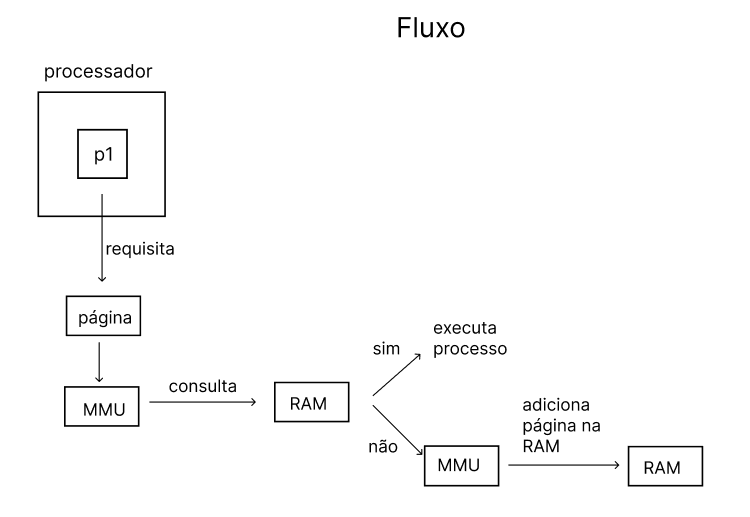
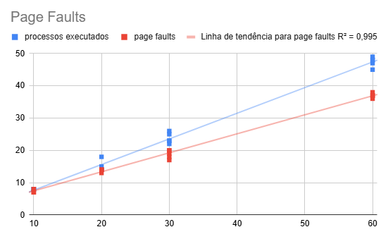
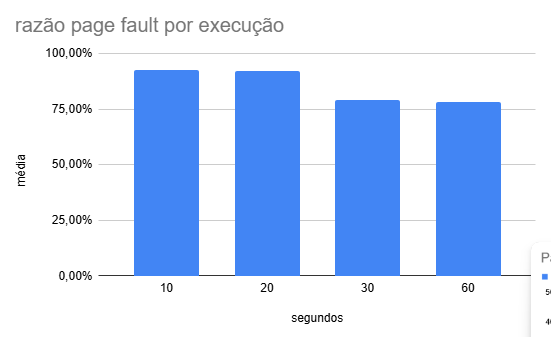

# MMU-simulator
O projeto visa simular o mapeamento da memória física e virtual de um computador utilizando uma MMU com um algoritmo de escolha de páginas vitímas aleatório.

## Como Rodar o Programa
O programa é escrito em C. Deve ser compilado utilizando `gcc gb.c -o nome_arquivo_executável`.
Depois de compilado pode ser executado com o comando `./nome_arquivo_executável`.
O tempo de execução pode ser alterado através da variável `RUNNING_TIME` - default é 10 segundos.

## Fluxo do programa
Dois processos rodam concorrentemente com o uso de threads. Quando um processo ocupa o processador ele requisita uma de suas páginas da memória virtual de forma aleatória. A MMU verifica se a página requisitada está presente na memória física (RAM), caso a página requisitada não esteja presente, a MMU põe a página na RAM e remove o processo do processador simulando um page fault. Caso a página requisitada esteja na RAM o processo roda normalmente imprimindo na tela que sua execução ocorreu normalmente.

O algoritmo que seleciona onde a página será inserida é aleatório, portanto, tanto páginas vitímas quanto espaços livres são tratados da mesma forma.

## Resultados
As medições foram realizadas em uma Virtual Box utilizando o Linux Mint com 1 CPU e 2048MB de memória base.

Como as páginas são carregadas uma por vez e sua seleção pelos processos é realizada de forma aleatória a probabilidade de um page fault é alta. Podemos ver através do gráfico abaixo que o número de page misses cresce linearmente conforme aumentamos o tempo de execução do programa. E sua taxa de page miss cai conforme aumentamos o tempo de execução do programa, mas estabiliza em volta dos 72%.

Podemos afirmar que o carregamento de uma página por vez não segue o princípio da localidade espacial e aumenta o número de page misses. Somado a isso, a escolha de páginas vítimas aleatórias também degrada a performance dado que não segue o princípio da localidade temporal. Desta forma, temos um algoritmo com uma performance considerada inaceitável para uso comparado aos algoritmos usados hoje em dia, com uma taxa de page miss menor do que 1%.
